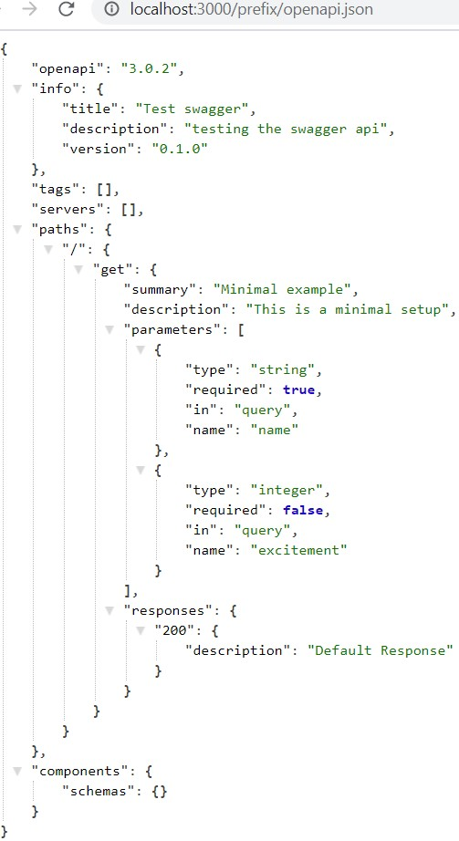
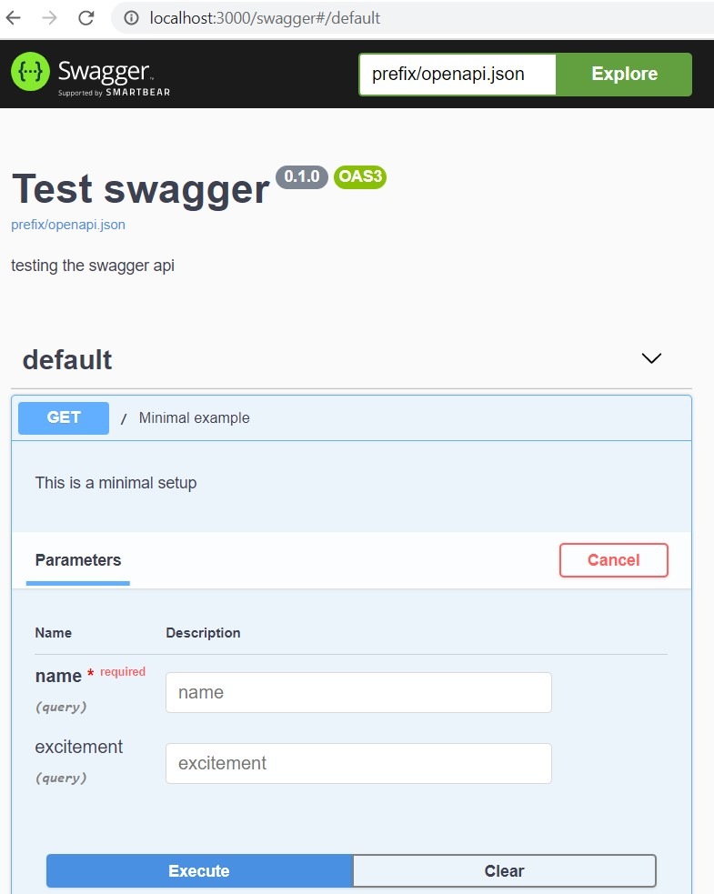
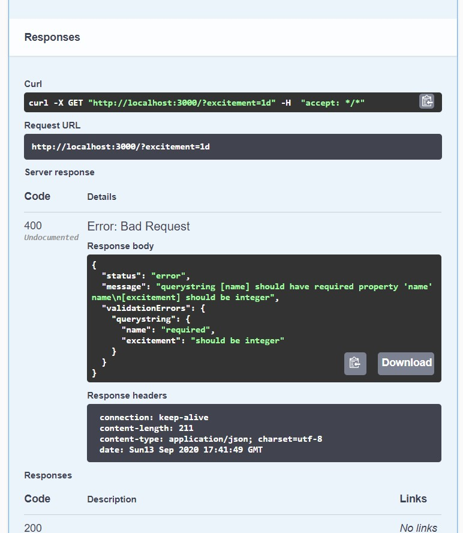

# koa-router-ajv-swaggergen

> Thanks to fastify-swagger, fastify-oas, koa-mapper. A lot of inspiration was taken from these libraries
> Thanks for koa-joi-swagger, and I did take inspiration from this lib as well.

This module does 3 things. This does not reimplement official koa-router(@koa/router) or tamper with its functionality, instead creates wrapper around koa-router. So you get validation and api documentation. Most other libraries either do one of the two things or simply requires maintaining separate openapi.yaml. 

1. Define schema while defining router
2. This Schema will automatically validate queryparams, headers, pathparams, body using ajv and provide errors in json format.
3. This Schema generates openapi 3 json.
4. (optional) Integrates swagger viewer to show the above openapi json

You can open this openapi3 json in http://editor.swagger.io to view the document.
Optionally you can integrate swagger viewer in your application. Follow the index.js to see how it is done. Following snippet shows the main parts.

## Quick start Example

* Create a new folder koa-ajv. Run `npm init -y` inside the new folder.
* Run `npm i koa @koa/router koa-bodyparser ajv` for installaing peer dependencies.
* Run `npm install koa-router-ajv-swaggergen` in your project. 
* Additioally if want to setup swagger viewer
* Run `npm install -D swagger-ui-dist`

Install peer dependencies if not already part of your project
Run `npm install koa @koa/router ajv formidable json-schema-resolver qs`

> You can replace npm with yarn commands above if you prefer yarn. Yarn 2 is also supported which will not create node_modules.

Create index.js file with the below content

```js
const Koa = require('koa')
const Router = require('@koa/router');
const Myrouter = require('koa-router-ajv-swaggergen');
const router = new Myrouter(new Router(), 'prefix');

const app = new Koa();

// // requires `npm install -D swagger-ui-dist` to run swagger ui locally, otherwise comment this line
Myrouter.setupSwaggerUI(router, 'prefix');

// // pass 'router' for json error response for this router, or pass 'app' for all errors to be converted to json
Myrouter.setupJsonErrors(router); 

router.get('/',
  {
    schema: {
      summary: 'Minimal example',
      description: 'This is a minimal setup',
      querystring: {
        type: 'object',
        required: ['name'],
        properties: {
          name: { type: 'string' },
          excitement: { type: 'integer' }
        }
      },
      responses: {
        200: {
          content: {
            'application/json': {
              schema:{
                type: 'object',
                properties: {
                  hello: { type: 'string' }
                }
              }
            }
          }
        }
      }
    }
  },
  (ctx) => {
    console.log('reqId', ctx.query.name);
    ctx.body = { hello: ctx.query.name, excitement:  ctx.query.excitement};
  }
);

app.use(router.routes());

app.listen(3000, () => {
  console.log(`server listening on 3000`)
})
```

If you are using npm. That is your node_modules folder got created. Then you cna run `node index.js`
or,
If you are using yarn 2 add scripts. Run project `yarn dev`
```json
"scripts": {
  "dev": "node index.js"
}
```

Open browser http://localhost:3000/prefix/openapi.json
If you have setup swagger ui viewer open in browser http://localhost:3000/swagger/ <== dont forget the trailing slash.





## Some more details


```js
const Router = require('@koa/router');
const Myrouter = require('../../routerwrapper');
const router = new Myrouter(new Router(), 'prefix'); // prefix is required to access different routes. Give some better names like auth, base, home, about etc.
```

Now you can use the `router` object like you would use koa-router i.e. even without a schema. But you can add schema which will start showing this route in swagger json and do schema validation.

```js
router.get('/auth/get-user-profile', {
    schema: {
        querystring: {
            username: { type: 'string' }
        },
        responses: {
            '200': {
                description: 'returns user details or redirect url /auth/login if not logged in'
            },
        }
    }
}, async (ctx) => {
  ctx.body = '';
})
```

### Organizing routes through prefixes

A certain group route can be given its own prefix. 

routes
├──── base.route.js  // prefix base eg. const router = new Myrouter(new Router(), 'base');
├──── home.route.js  // prefix home eg. const router = new Myrouter(new Router(), 'home');
└──── auth.route.js  // prefix auth eg. const router = new Myrouter(new Router(), 'auth');

Inside index file
const baseRoutes = require('./routes/base.route');
const homeRoutes = require('./routes/home.route');
const authRoutes = require('./routes/auth.route');

app.use(baseRoutes.routes());
app.use(homeRoutes.routes());
app.use(authRoutes.routes());
 
Now the apidoc json is available at http://localhost:<port>/swagger/<prefix>/openapi.json. You can have other router instances wrapped with a different prefix, and those will be available http://localhost:3000/swagger/base/openapi.json as so on.

You open swagger viewer with the below url as search apis with prefixes. 
http://localhost:3000/swagger/

Enter `<prefix>/openapi.json` in the swagger viewer search box.


### Reusable schema
You can register schema globally in the router and reuse it in multiple routes

```js
router.addSchema('commonSchema', {
  type: 'object',
  properties: {
    hello: { type: 'string' }
  }
})

router.post('/', {
  schema: {
    body: { $ref: '#/components/schemas/commonSchema' },
    headers: { $ref: '#/components/schemas/commonSchema' }
  }
}, (ctx) => { ctx.body = 'post /'; })
```

### Validation 
A more complete example, in fact this is directly taken from fastify-swagger documentation.
Note the querystring and pathparams objects can be simplified as in this example. But if you need to control required then expanded format will need to be defined.  

```js
const bodyJsonSchema = {
  type: 'object',
  required: ['requiredKey'],
  properties: {
    someKey: { type: 'string' },
    someOtherKey: { type: 'number' },
    requiredKey: {
      type: 'array',
      maxItems: 3,
      items: { type: 'integer' }
    },
    nullableKey: { type: ['number', 'null'] }, // or { type: 'number', nullable: true }
    multipleTypesKey: { type: ['boolean', 'number'] },
    multipleRestrictedTypesKey: {
      oneOf: [
        { type: 'string', maxLength: 5 },
        { type: 'number', minimum: 10 }
      ]
    },
    enumKey: {
      type: 'string',
      enum: ['John', 'Foo']
    },
    notTypeKey: {
      not: { type: 'array' }
    }
  }
}

// This is less verbose way of defining schema which works for querystring and params 
// You can choose more verbose way of defining schema in the ajv way
const queryStringJsonSchema = {
  name: { type: 'string' }, // add required: true if you want to make it required
  excitement: { type: 'boolean' } // query strings are normally strings but it is coerced to boolean and then validated
}

const paramsJsonSchema = {
  par1: { type: 'string' },
  par2: { type: 'number' }
}

const headersJsonSchema = {
  type: 'object',
  properties: {
    'x-foo': { type: 'string' }
  },
  required: ['x-foo']
}

const schema = {
  body: bodyJsonSchema,
  querystring: queryStringJsonSchema,
  params: paramsJsonSchema,
  headers: headersJsonSchema
}

router.post('/the/url/:par1/:par2', { schema }, (ctx) => {
  ctx.body = 'post /the/url';
})
```

## Integrating swagger viewer

Integrating swagger viewer is trivial. Get the static distribution instead of serving static directory from node_modules, serve it and rewrite content as required. I found this is the easiest way to mount into a different directory other than root. Swagger js and css'es do not understand relative paths 

```
npm install -D swagger-ui-dist
```
Easy way to expose swagger to use a provided helper method. 

```javascript
Myrouter.setupSwaggerUI(router, 'prefix'); // prefix is the initial, you can have many prefixes, check later sections on managing multiple route prefixes
```

Another helper method is there to setup error response generation
```
Myrouter.setupJsonErrors(app);
```


## Typescript support

All the types are derived from AJV. Which causes few annoying issues around nullable:true and requires takes never[]. But if you follow interface based design none of these are of concern.
The headers, querystring, params supports shortcut propertiesSchema as well as full JsonSchemaType.

```typescript
import { JSONSchemaType } from "ajv";
import { PropertiesSchema } from "ajv/dist/types/json-schema"
...
interface MyType {
  foo: number;
  bar: string;
}

router.post("/test/:par1/:par2", {
  schema: {
    headers: {
      type: 'object',
      properties: {
        'foo': { type: 'string' },
        'bar': { type: 'number' },
      },
      required: ['foo']   // see if you pass MyType interface you dont need to cast to never[]
    } as JSONSchemaType<MyType>, // This usage is ideal, i.e. by passing interface eg. MyType
    params: {
      par1: { type: "string",  nullable: true},
      par2: { type: "number", nullable: true },
    } as PropertiesSchema<any>, // pass empty type or else make them explicit interface eg. MyType
    querystring: {
      name: { type: "string",  nullable: true},
      excitement: { type: "number",  nullable: true }
    }, // Not passing any type behaves like above PropertiesSchema
    body: {
      type: 'object',
      required: [<never> 'requiredKey'], 
      properties: {
        someKey: { type: 'string',},
        someOtherKey: { type: 'number',},
        requiredKey: {
          type: 'array',
          maxItems: 3,
          items: { type: 'integer'},
          nullable: true
        },
        nullableKey: { type: ['number', 'null']}, // or { type: 'number', nullable: true }
        multipleTypesKey: { type: ['boolean', 'number']},
        multipleRestrictedTypesKey: {
          oneOf: [
            { type: 'string', maxLength: 5},
            { type: 'number', minimum: 10 }
          ],
        },
        enumKey: {
          type: 'string',
          enum: ['John', 'Foo'],
        },
        notTypeKey: {
          not: { type: 'array', nullable: true },
        }
      }
    }  as JSONSchemaType<{}>,   
  },
},
async (ctx) => {
  console.log(ctx.body) 
  ctx.body = { hello: ctx.query.name, excitement: ctx.query.excitement };
});
```

## For developers of this library
Git clone the repository.
Run `npm install`
You run the `node src\index-test.js` or simply run `npm run dev`. It has a few samples to get started.
Open browser at [http://localhost:3000/swagger/](http://localhost:3000/swagger/)


## Release Notes
2024-02-02:
  Added support for @koa/router prefix or context path 
  `const router = new MyRouter(new Router({ prefix: '/api/mock' }), 'myprefix');`
  Removed formidable dependency
  Added simple authorization
2024-01-01:
  Releasing v1.1.0. Increased feature version.
  Added type definitions derived from ajv. Updated readme.
  Removed annoying ajv warning. 
2023-04-30:
  * Added linting via eslint+babel
  * Updated packages
  * Fixed documentation of responses
  * Fixed some eslint issues
2021-10-02:
  * Added support for ajv 8.x.x, previously it required passing extra options
  * Improved schema generation to update swagger 2.0.x to openapi 3.0.x format. Previously swagger still rendered but with warnings
  * Improved validation schema generation for type shorthand `{prop: {type: 'array<string>'}}`, same can be represented in other formats like `{prop: schema: transformType('array<integer>')}` or  `{prop: schema: { type: 'array', items: { type: 'integer' } } }`
  * changed swagger url from http://localhost:3000/swagger to http://localhost:3000/swagger/. Note the trailing slash. 
  * New server path for openapi.json, there are now served under 'swagger' context path. 'http://localhost:3000/swagger/<prefix>/openapi.json. Previously same url would have been http://localhost:3000/<prefix>/openapi.json

2020-12-06: 
  * Moved dependencies to peerDependencies so that client projects are fee to choose their versions. Unfortunately this also adds burden on developer to maintain all the dependencies. `npm install koa @koa/router ajv delegates extend flatten formidable json-schema-resolver qs clone`
  * Added support for yarn 2/berry
  * Removed dependencies flatten, clone, extend, delegates
  * Added parsing body without `.type`
  * Fixed validation with schema reference as full-path
  * Fixed delete method handling so that it appears in swagger
